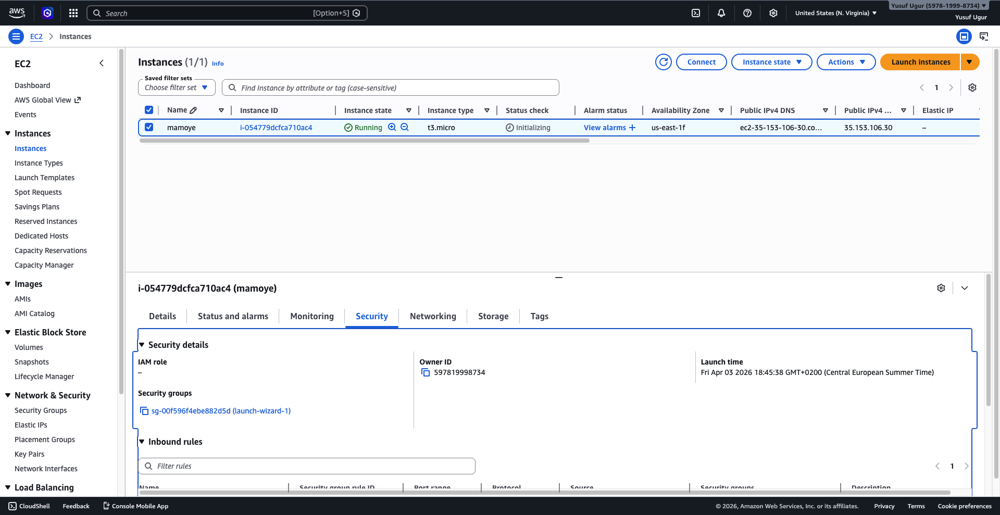

# AWS EC2 Nginx Website (Single Server to Load Balanced Architecture)

This project shows my learning process of deploying a static website on AWS, starting from a single EC2 instance and then improving the setup with a load balanced architecture.

## Version 1 - Single Server

In the first stage, I created a basic web server:

- Launched an EC2 instance (Ubuntu)
- Connected using SSH
- Installed and configured Nginx
- Deployed a simple static HTML website
- Enabled public access using Security Groups

## Version 2 - Load Balanced Setup

In the second stage, I extended the architecture to improve availability:

- Created multiple EC2 instances
- Configured Nginx on each instance
- Deployed different HTML responses on each server for testing
- Created a Target Group and registered the instances
- Set up an Application Load Balancer (ALB)
- Configured HTTP listener and routing
- Used health checks to monitor instance status
- Debugged issues related to security groups and availability zones

## Architecture Overview

- EC2 instances running Ubuntu
- Nginx web server
- Application Load Balancer
- Target Group with health checks
- Security Groups for network control

## Screenshots

### Website

### EC2 Instances

### Load Balancer

## What I Learned

- How to deploy and manage EC2 instances
- Basic Linux server administration
- Installing and configuring Nginx
- Load balancing concepts in AWS
- Troubleshooting real-world networking issues
- Understanding Security Groups and traffic flow
- Basics of high availability design

## Result

The final setup successfully distributes incoming traffic across multiple EC2 instances using an Application Load Balancer.
